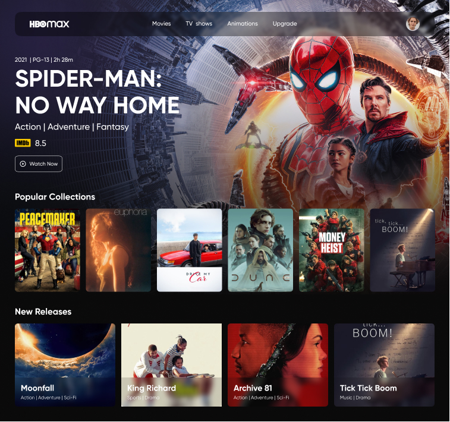
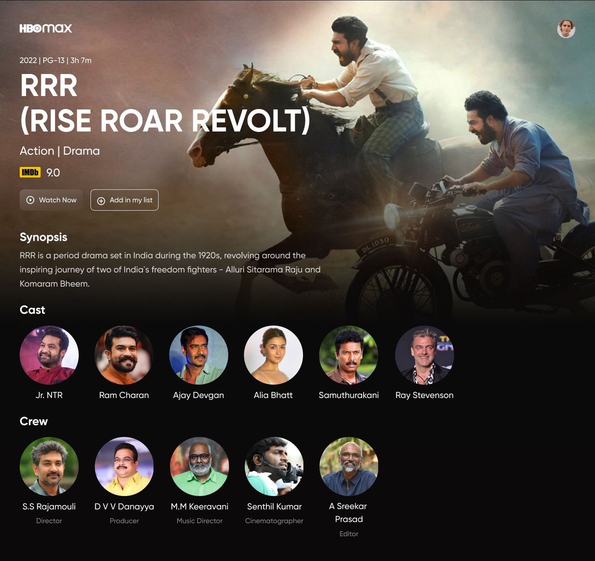

<h1 align="center">
  HBO Max Redesign Home
</h1>

  

<h1 align="center">
  HBO Max Redesign Movie
</h1>

  

  <a href="#-tecnologias">Tecnologias</a>&nbsp;&nbsp;&nbsp;|&nbsp;&nbsp;&nbsp;
  <a href="#-projeto">Projeto</a>&nbsp;&nbsp;&nbsp;|&nbsp;&nbsp;&nbsp;
  <a href="#-license">License</a>

 

  

  

  

## 🚀 Tecnologias

Esse projeto foi desenvolvido com as seguintes tecnologias:

- HTML
- [Tailwind CSS](https://tailwindcss.com/)

## 🚧 Projeto:

Projeto Finalizado na versão web somente.

## 🎨 Inspiração:

Figma: https://www.figma.com/file/2A51gQJCk5V6LxcIh2en0b/HBO-Max-Redesign-Web-App-(Community)

## 📝 License

Esse projeto está sob a licença MIT. Veja o arquivo [LICENSE](LICENSE) para mais detalhes.

---

Feito com ♥ by Wellerson Douglas